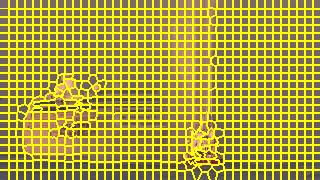
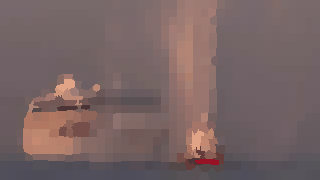

# Color-Segmentation

## Implementation of SLIC Segmentation
slic_segmentation.py will take any video clip, apply SLIC Segmentation and save the result as GIF file.

- change video_path & gif_save_path to your directory

For Label to RGB Boundries

- change line 19 to: labels, markes_boundries, superpixels = segment_video(video_path, n_frames, n_segments, compactness)
- change line 20 to: save_gif(save_gif(markes_boundries, gif_save_path), gif_save_path)
- uncomment line 42,43 for Label to RGB Boundries
- remove '#' in line 50

